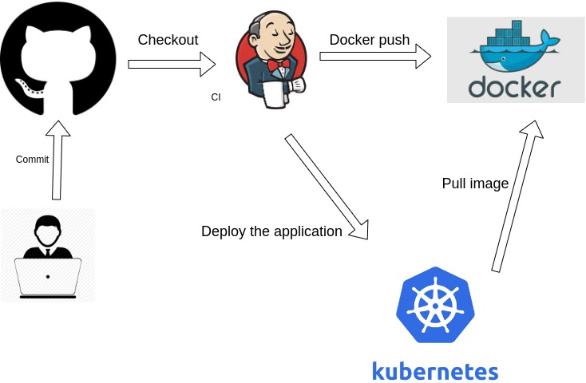

# tasks-pintu

code that has been created will be pushed to the github repo then jenkins will be triggered by the github. after that, jenkins will create an image of the code that has been created using the dockerfile. The next step will push the docker image to the docker registry. After these steps have been run, jenkins will deploy the docker image into kubernetes by exect deploymentservice.yml.

NB: **I don't deploy to kubernetes exactly, I just create the manifest only**

Image Link: https://hub.docker.com/repository/docker/leonswww/node-app